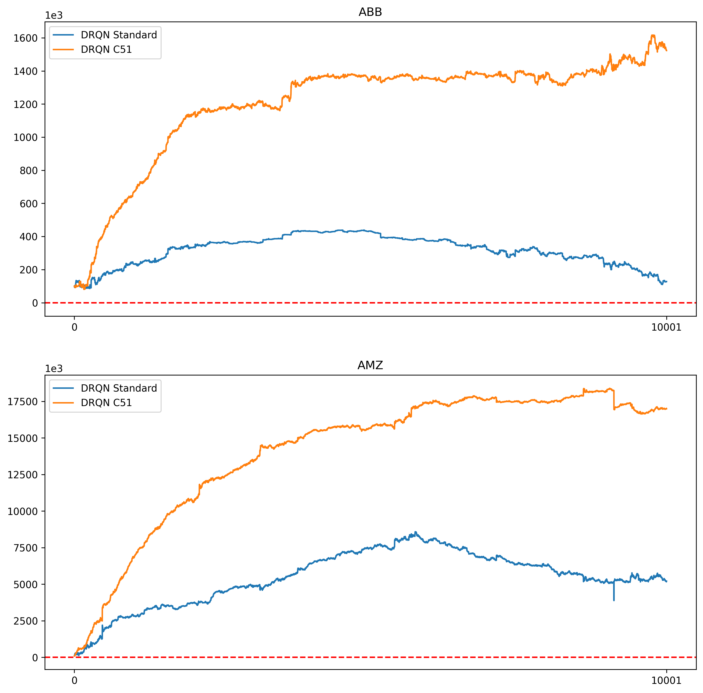

# DRQN C51 Financial Trading

This repository contains the code used to apply **Deep Reinforcement Learning (DRL)** to the problem of **financial trading**.
The main contribution is the use of **C51 algorithm** (traditionally used for reinforcement learning on the Atari games)
in a problem that has an inherently recurrent component: more specifically, the architecture of the **DRQN 
(Deep Recurrent Q-Network)** has been modified to support the C51 algorithm by adding another linear layer before the 
LSTM module.

## Credits

The data was taken from
[Lixu Wang - DRQN Stock Trading](https://github.com/conditionWang/DRQN_Stock_Trading): starting from his work, I
organized the repository in a different way and I added all that concerns the C51 algorithm. I refer to his repository
for the original code, which was the implementation of the paper _"Financial Trading as a Game: A Deep Reinforcement
Learning Approach"_, by Huang C.Y.

## Results

The algorithm was tested on 10000 episodes and, in some cases, there was an increase of 38% in the model performances
with respect to the author of the code, as shown below.

